```mermaid
sequenceDiagram
    participant T as Traveller Agent
    participant H as Helper Agent
    
    Note over T,H: Both agents mutually authenticated (Phase 2)
    
    Note over T: Generate session_key_T (AES-256)<br/>Encrypt with Helper's RSA public key
    
    T->>H: CLIENT_HELLO<br/>{session_id, nonce_T, my_certificate,<br/>RSA_encrypt(session_key_T), signature}
    
    Note over H: Verify Traveller's certificate<br/>Verify signature<br/>Decrypt session_key_T<br/>Generate session_key_H<br/>Encrypt nonce_T as challenge
    
    H->>T: SERVER_HELLO<br/>{nonce_H, RSA_encrypt(session_key_H),<br/>AES_encrypt(nonce_T), signature}
    
    Note over T: Verify Helper's certificate<br/>Verify signature<br/>Decrypt session_key_H<br/>Verify challenge matches nonce_T<br/>Encrypt nonce_H as response
    
    T->>H: CLIENT_CONFIRM<br/>{AES_encrypt(nonce_H), signature}
    
    Note over H: Verify challenge response<br/>✓ Session Established
    
    Note over T,H: ✅ Encrypted Session Active<br/>All messages encrypted with AES-256-GCM
    
    T->>H: POST /agent/message<br/>{encrypted_payload, signature}
    H->>T: {encrypted_response, signature}
```

# Encrypted Agent-to-Agent (A2A) Protocol

A secure, minimalistic Agent-to-Agent (A2A) communication protocol inspired by Google's A2A paradigm. The protocol enables independent agents to discover, authenticate, and communicate securely through a distributed architecture with cryptographic trust establishment.

---

## 📋 Project Overview

This project implements a **Public Key Infrastructure (PKI)** for agent-to-agent communication where agents cryptographically authenticate with a central Controller (Certificate Authority), receive signed certificates, and establish secure peer-to-peer communication channels.

### Key Objectives

- **Cryptographic Identity**: RSA 2048-bit key pairs for each agent with self-signed identity cards
- **Certificate Authority**: Controller validates agents and issues signed certificates acting as a trust anchor
- **Agent Discovery**: Secure peer discovery through certificate exchange with dual signature verification
- **Encrypted Communication**: End-to-end encryption using hybrid cryptography (RSA + AES-256-GCM)
- **REST-Based Distributed Architecture**: Each agent operates as an independent HTTPS service with unique network identity
- **Modular & Extensible Design**: Foundation for autonomous multi-agent systems with secure coordination

---

## 🗓️ Protocol Timeline

```mermaid
timeline
    title A2A Protocol Implementation Phases
    
    section Phase 1: Trust Establishment
        Agent Registration : Controller generates RSA keys
                           : Agents generate RSA keys
                           : Agent card creation
        Trust Anchor : Controller exposes public key
                     : Agents download controller public key
        Certificate Issuance : Agent signs agent card
                            : Controller validates (7 checks)
                            : Controller signs certificate
        Verification : Agent verifies controller signature
                     : Bidirectional trust established
                     : Status: ✅ IMPLEMENTED
    
    section Phase 2: Agent Discovery
        Certificate Sharing : Expose /agent/certificate endpoint
                           : Certificate caching
        Peer Authentication : Fetch peer certificate
                           : Verify agent signature
                           : Verify controller signature
        Trust Network : Build trusted peers cache
                      : Transitive trust via controller
                      : Status: 🔄 DESIGN COMPLETE
    
    section Phase 3: Secure Communication
        Session Establishment : Generate ephemeral AES keys
                             : RSA-encrypt session keys
                             : Three-way handshake
        Encrypted Messaging : AES-256-GCM encryption
                           : Message authentication (AEAD)
                           : Forward secrecy
        Production Ready : Session management
                        : Message persistence
                        : Status: 🔄 DESIGN COMPLETE
```

---

## 🏗️ System Architecture


### Component Breakdown

| Component | Port | Role | Technology |
|-----------|------|------|------------|
| **Controller (CA)** | 5000 | Certificate Authority, agent validation, certificate issuance | Flask + REST API + RSA-PSS |
| **Traveller Agent** | 5002 | Independent agent with identity, certificate, secure communication | Flask + Threading + Cryptography |
| **Helper Agent** | 5001 | Independent agent with identity, certificate, secure communication | Flask + Threading + Cryptography |

---

## 🔐 Protocol Implementation

### Phase 1: Agent Registration & Trust Establishment (✅ Implemented)

```mermaid
sequenceDiagram
    participant H as Helper Agent<br/>(Port 5001)
    participant CS as Central Server<br/>(Port 5000)
    participant T as Traveller Agent<br/>(Port 5002)
    
### Phase 1: Agent Registration & Trust Establishment (✅ Implemented)

**Purpose:** Establish cryptographic identities and trust anchor for the agent network

**Key Features:**
- Controller generates RSA 2048-bit key pair (acts as Certificate Authority)
- Agents generate RSA 2048-bit key pairs and create agent cards
- Agents download controller's public key (trust anchor establishment)
- Agents sign their agent cards and register with controller
- Controller performs 7-step validation and issues signed certificates
- Agents verify controller's signature on certificates (bidirectional trust)

```mermaid
sequenceDiagram
    participant T as Traveller Agent<br/>(Port 5002)
    participant CS as Controller (CA)<br/>(Port 5000)
    participant H as Helper Agent<br/>(Port 5001)
    
    Note over CS: Startup: Generate RSA Keys<br/>controller_private_key<br/>controller_public_key
    
    Note over T,H: Phase 1A: Trust Anchor Establishment
    
    T->>CS: GET /verify/public-key
    CS-->>T: {public_key, key_id: controller_001}
    Note over T: controller_public_key loaded<br/>✓ Trust Anchor Established
    
    H->>CS: GET /verify/public-key
    CS-->>H: {public_key, key_id: controller_001}
    Note over H: controller_public_key loaded<br/>✓ Trust Anchor Established
    
    Note over T,H: Phase 1B: Registration & Certificate Issuance
    
    Note over T: Generate RSA keys<br/>Create agent_card<br/>Sign with private_key
    
    T->>CS: POST /verify/register<br/>{agent_card, agent_signature, nonce, timestamp}
    
    Note over CS: 7-Step Validation:<br/>✓ Version<br/>✓ Nonce unique<br/>✓ Timestamp fresh<br/>✓ Agent ID unique<br/>✓ Not expired<br/>✓ Signature valid<br/>✓ Track nonce
    
    Note over CS: Sign agent_card with<br/>controller_private_key
    
    CS-->>T: {certificate with controller_signature,<br/>issued_at, expires_at}
    
    Note over T: Verify controller_signature<br/>using controller_public_key<br/>✓ Certificate Authentic<br/>✓ Bidirectional Trust
    
    Note over H: Generate RSA keys<br/>Create agent_card<br/>Sign with private_key
    
    H->>CS: POST /verify/register<br/>{agent_card, agent_signature, nonce, timestamp}
    
    Note over CS: 7-Step Validation + Sign
    
    CS-->>H: {certificate with controller_signature}
    
    Note over H: Verify controller_signature<br/>✓ Bidirectional Trust
    
    Note over T,H: ✅ Phase 1 Complete<br/>Both agents have controller-signed certificates
```

**Security Properties:**
- ✓ Mutual authentication (agent ↔ controller)
- ✓ Non-repudiation (RSA-PSS signatures)
- ✓ Replay attack prevention (nonces + timestamps)
- ✓ Certificate tampering detection (signature verification)
- ✓ Time-bound validity (expiration timestamps)

[📖 Detailed Documentation](documentation/PHASE_1_REGISTRATION_AND_TRUST.md)

---

### Phase 2: Agent-to-Agent Discovery & Certificate Exchange (🔄 Design Complete)

### Phase 2: Agent-to-Agent Discovery & Certificate Exchange (🔄 Design Complete)

**Purpose:** Enable secure peer discovery and establish agent-to-agent trust

**Key Features:**
- Agents expose their certificates via `/agent/certificate` endpoint
- Peer authentication by verifying both agent and controller signatures
- Trust transitivity: Agents trust peers endorsed by the trusted controller
- Trusted peer caching for efficient repeated communication


**Security Properties:**
- ✓ Transitive trust through controller (PKI model)
- ✓ Dual signature verification (agent + controller)
- ✓ Certificate expiration checking
- ✓ Attack resistance (fake agents, MITM, tampering)

[📖 Detailed Documentation](documentation/PHASE_2_AGENT_DISCOVERY.md)

---

### Phase 3: Secure Communication & Encrypted Handshake (🔄 Design Complete)

**Purpose:** Establish encrypted sessions and enable secure message exchange

**Key Features:**
- Hybrid encryption: RSA for key exchange, AES-256-GCM for messages
- Three-way handshake with challenge-response authentication
- Ephemeral session keys for forward secrecy
- Authenticated encryption (AEAD) for confidentiality and integrity

**Key Features:**
- Hybrid encryption: RSA for key exchange, AES-256-GCM for messages
- Three-way handshake with challenge-response authentication
- Ephemeral session keys for forward secrecy
- Authenticated encryption (AEAD) for confidentiality and integrity



**Security Properties:**
- ✓ End-to-end encryption (AES-256-GCM)
- ✓ Forward secrecy (ephemeral session keys)
- ✓ Mutual authentication (certificates + signatures)
- ✓ Replay protection (nonces + timestamps)
- ✓ Message integrity (AEAD authentication tags)

[📖 Detailed Documentation](documentation/PHASE_3_SECURE_COMMUNICATION.md)

---

## 🛡️ Security Architecture

### Cryptographic Primitives

| Component | Algorithm | Key Size | Purpose |
|-----------|-----------|----------|---------|
| **Asymmetric Keys** | RSA | 2048-bit | Identity, signatures, key exchange |
| **Signature Scheme** | RSA-PSS | SHA-256 | Agent card signing, certificate signing |
| **Key Exchange** | RSA-OAEP | SHA-256 | Session key encryption |
| **Symmetric Encryption** | AES-GCM | 256-bit | Message encryption (Phase 3) |
| **Hash Function** | SHA-256 | 256-bit | Signatures, nonces |
| **Nonce Generation** | secrets.token_hex | 256-bit | Replay prevention |

### Trust Model


### Attack Resistance Matrix

| Attack Vector | Defense Mechanism | Status |
|--------------|-------------------|--------|
| **Fake Agent Impersonation** | Cannot forge controller signature without controller_private_key | ✅ Protected |
| **Man-in-the-Middle (MITM)** | Certificate verification + HTTPS/TLS + Signature verification | ✅ Protected |
| **Replay Attack** | Nonce tracking + timestamp freshness validation | ✅ Protected |
| **Certificate Tampering** | Signature verification fails if any field modified | ✅ Protected |
| **Eavesdropping** | End-to-end encryption (Phase 3) | 🔄 Pending |
| **Session Hijacking** | Session binding + per-message signatures (Phase 3) | 🔄 Pending |
| **Key Compromise** | Forward secrecy with ephemeral keys (Phase 3) | 🔄 Pending |

---

## 🚀 Quick Start

### Prerequisites

```bash
Python 3.8+
Flask
flask-cors
cryptography
requests
python-dotenv
```

### Installation

1. **Clone the repository**
```bash
git clone <repository-url>
cd EncryptedA2AProtocol
```

2. **Set up virtual environments** (each component has its own venv)
```bash
# Controller
cd A2AControlServer
python -m venv venv
.\venv\Scripts\Activate.ps1  # Windows
source venv/bin/activate      # Linux/Mac
pip install -r requirements.txt

# Traveller Agent
cd ../A2ATraveller
python -m venv venv
.\venv\Scripts\Activate.ps1
pip install -r requirements.txt

# Helper Agent
cd ../A2AHelper
python -m venv venv
.\venv\Scripts\Activate.ps1
pip install -r requirements.txt
```

3. **Generate SSL Certificates** (self-signed for development)
```bash
# In each directory (A2AControlServer, A2ATraveller, A2AHelper)
openssl req -x509 -newkey rsa:2048 -keyout key.pem -out cert.pem -days 365 -nodes -subj "/CN=localhost"
```

4. **Configure environment variables**

Create `.env` files in each directory:

```env
# A2AControlServer/.env
PORT=5000

# A2ATraveller/.env
PORT=5002
AGENT_ID=traveller_1
CONTROLLER_ADDRESS=https://localhost:5000

# A2AHelper/.env
PORT=5001
AGENT_ID=helper_1
CONTROLLER_ADDRESS=https://localhost:5000
```

### Running the System

**Option 1: Manual Launch (3 separate terminals)**
```bash
# Terminal 1 - Controller
cd A2AControlServer
.\venv\Scripts\Activate.ps1
python server.py

# Terminal 2 - Traveller Agent
cd A2ATraveller
.\venv\Scripts\Activate.ps1
python traveller.py

# Terminal 3 - Helper Agent
cd A2AHelper
.\venv\Scripts\Activate.ps1
python helper.py
```

**Option 2: Automated Launch (Windows)**
```bash
.\start_all.bat
```

---

## 💻 Agent CLI Commands

Each agent provides an interactive command-line interface for manual control:

### Phase 1 Commands (✅ Implemented)

```bash
traveller_1> help
Commands: help | status | trust | register | exit

traveller_1> status
Agent: traveller_agent_001, Port: 5002, Status: Active
Trust Anchor: ✗ Not established

traveller_1> trust
Establishing trust with controller at https://localhost:5000...
[INFO] Downloading controller public key...
[INFO] ✓ Controller public key loaded successfully
[INFO] Key ID: controller_001
[INFO] Trust anchor established
✓ Controller public key loaded

traveller_1> register
Registering agent with controller at https://localhost:5000...
[INFO] Certificate received from controller

[DEBUG] ═══════════════════════════════════════════════════
[DEBUG] Starting Controller Signature Verification
[DEBUG] ═══════════════════════════════════════════════════
[DEBUG] ✓ Controller public key is loaded
[DEBUG] Agent ID in certificate: traveller_agent_001
[DEBUG] Certificate issued at: 1770888835
[DEBUG] Certificate expires at: 1770975235
[DEBUG] Controller signature (first 50 chars): YNVrUGyV...
[DEBUG] Canonical JSON size: 795 bytes
[DEBUG] Verifying controller's RSA-PSS signature...
[DEBUG] ✓ Cryptographic verification PASSED
[DEBUG] ✓ Controller signature is valid
[DEBUG] ✓ Certificate authenticity confirmed
[DEBUG] ✓ Issued by trusted controller
[DEBUG] ═══════════════════════════════════════════════════
[DEBUG] Bidirectional Trust Established (Agent ↔ Controller)
[DEBUG] ═══════════════════════════════════════════════════

[INFO] ✓ Controller signature verified successfully
✓ Registration successful!
Certificate received from controller
Agent ID: traveller_agent_001
Controller signature: YNVrUGyV...

traveller_1> exit
Shutting down...
```

### Planned Commands (Phase 2-3)

```bash
# Phase 2: Discovery
traveller_1> discover helper https://localhost:5001   # Authenticate peer
traveller_1> peers                                    # List trusted peers

# Phase 3: Communication
traveller_1> connect helper                           # Establish encrypted session
traveller_1> send helper "Hello!"                     # Send encrypted message
traveller_1> sessions                                 # List active sessions
traveller_1> disconnect helper                        # Close session
```

---

## 📡 API Endpoints

### Controller Endpoints (Port 5000)

| Method | Endpoint | Description | Phase | Status |
|--------|----------|-------------|-------|--------|
| `GET` | `/verify/public-key` | Get controller's public key (trust anchor) | 1 | ✅ |
| `POST` | `/verify/register` | Register agent and receive signed certificate | 1 | ✅ |
| `GET` | `/verify/cards` | List all registered agent certificates | 1 | ✅ |
| `POST` | `/verify/reset` | Clear database (development/testing) | 1 | ✅ |
| `GET` | `/health` | Controller health check | 1 | ✅ |

### Agent Endpoints (Ports 5001, 5002)

| Method | Endpoint | Description | Phase | Status |
|--------|----------|-------------|-------|--------|
| `GET` | `/` | Health check | 1 | ✅ |
| `GET` | `/health` | Service status | 1 | ✅ |
| `GET` | `/agent/certificate` | Share agent's certificate with peers | 2 | 🔄 |
| `POST` | `/agent/handshake` | Establish encrypted session | 3 | 🔄 |
| `POST` | `/agent/message` | Send/receive encrypted message | 3 | 🔄 |

### Example API Calls

**Get Controller Public Key:**
```powershell
Invoke-RestMethod -Uri https://localhost:5000/verify/public-key -SkipCertificateCheck
```

**Reset Database (Development):**
```powershell
Invoke-RestMethod -Uri https://localhost:5000/verify/reset -Method POST -SkipCertificateCheck
```

**View Registered Agents:**
```powershell
Invoke-RestMethod -Uri https://localhost:5000/verify/cards -SkipCertificateCheck
```

---

## 🔒 Security Features

### Implemented (Phase 1) ✅
- ✅ **RSA 2048-bit Key Pairs**: Each agent and controller has unique asymmetric keys
- ✅ **RSA-PSS Signatures**: Cryptographic signatures on agent cards and certificates
- ✅ **Certificate Authority Pattern**: Controller acts as CA, issues signed certificates
- ✅ **Trust Anchor Distribution**: Agents download and verify controller's public key
- ✅ **7-Step Registration Validation**: Version, nonce uniqueness, timestamp, agent ID, expiry, signature, nonce tracking
- ✅ **Bidirectional Trust**: Agents verify controller signatures, controller verifies agent signatures
- ✅ **Nonce-Based Replay Prevention**: Unique 256-bit nonces tracked per registration
- ✅ **Timestamp Freshness**: 5-minute validity window for registration requests
- ✅ **Certificate Expiration**: Agent cards (1 hour) and certificates (24 hours) time-bound
- ✅ **Canonical JSON**: Consistent serialization for signature stability
- ✅ **HTTPS/TLS**: Self-signed certificates for encrypted transport (development)

### Designed (Phase 2-3) 🔄
- 🔄 **Dual Signature Verification**: Verify both agent and controller signatures on peer certificates
- 🔄 **Transitive Trust**: Trust peers through controller's PKI endorsement
- 🔄 **Hybrid Encryption**: RSA-OAEP for key exchange, AES-256-GCM for messages
- 🔄 **Forward Secrecy**: Ephemeral session keys independent of long-term identities
- 🔄 **Authenticated Encryption (AEAD)**: AES-GCM provides confidentiality and integrity
- 🔄 **Challenge-Response Handshake**: Prove key possession without revealing keys
- 🔄 **Session Binding**: Session IDs prevent cross-session attacks
- 🔄 **Per-Message Signatures**: Verify sender authenticity on every message

### Future Enhancements 🔮
- 🔮 Certificate Revocation Lists (CRLs)
- 🔮 Active adversary simulation (MITM, replay, eavesdropping)
- 🔮 Adaptive encryption based on threat detection
- 🔮 Zero-trust architecture principles
- 🔮 Message persistence with searchable encryption

---

## 📂 Project Structure

```
EncryptedA2AProtocol/
├── A2AControlServer/              # Controller (CA) - Port 5000
│   ├── venv/
│   ├── routes/
│   │   ├── __init__.py
│   │   ├── health.py
│   │   └── verify_validate_agent.py    # Registration & validation logic
│   ├── server.py                        # Flask application
│   ├── cert.pem, key.pem                # SSL certificates
│   ├── .env                             # Configuration
│   └── requirements.txt
│
├── A2ATraveller/                  # Traveller Agent - Port 5002
│   ├── venv/
│   ├── routes/
│   │   ├── __init__.py
│   │   └── register_agent.py            # TravellerAgent class
│   ├── traveller.py                     # CLI + Flask app
│   ├── cert.pem, key.pem
│   ├── .env
│   └── requirements.txt
│
├── A2AHelper/                     # Helper Agent - Port 5001
│   ├── venv/
│   ├── routes/
│   │   ├── __init__.py
│   │   └── register_agent.py            # HelperAgent class
│   ├── helper.py                        # CLI + Flask app
│   ├── cert.pem, key.pem
│   ├── .env
│   └── requirements.txt
│
├── documentation/                 # Comprehensive protocol documentation
│   ├── README.md                        # Documentation index
│   ├── PHASE_1_REGISTRATION_AND_TRUST.md     # ✅ Implemented
│   ├── PHASE_2_AGENT_DISCOVERY.md            # 🔄 Design complete
│   └── PHASE_3_SECURE_COMMUNICATION.md       # 🔄 Design complete
│
├── Illustrations/                 # Architecture diagrams
├── README.md                      # This file - Project overview
├── start_all.bat                  # Automated launcher (Windows)
└── .gitignore
```

---

## 🔬 Research & Development Roadmap

### Phase 1: Foundation ✅ (Current)
- [x] Multi-agent REST architecture
- [x] Basic agent discovery
- [x] Three-way handshake protocol
- [x] Message relay infrastructure
- [x] CLI-based manual control

### Phase 2: Security Enhancements 🔄 (In Progress)
- [ ] Public key infrastructure for Agent Cards
- [ ] Encrypted message payloads
- [ ] Digital signature verification
- [ ] Replay attack mitigation
- [ ] Session key management

### Phase 3: Autonomy 🔮 (Planned)
- [ ] Autonomous maze-solving algorithms (A*, DFS, BFS)
- [ ] Intelligent agent decision-making
- [ ] Dynamic task allocation
- [ ] Multi-objective optimization

### Phase 4: Advanced Security 🔮 (Future)
- [ ] Active adversary simulation (MITM, replay, eavesdropping)
- [ ] Threat-aware adaptive encryption
- [ ] Anomaly detection in agent communication
- [ ] Zero-trust architecture principles

### Phase 5: Scalability 🔮 (Future)
- [ ] Support for 10+ concurrent agents
- [ ] Dynamic agent joining/leaving
- [ ] Distributed consensus mechanisms
- [ ] Peer-to-peer mesh networking

---

## 🧪 Testing

```bash
# Test server health
curl https://localhost:5000/health

# Test agent registration
curl -X POST https://localhost:5000/agent/register \
  -H "Content-Type: application/json" \
  -d '{"agent_id":"test_agent","address":"https://localhost:5003"}'

# Test agent discovery
curl https://localhost:5000/agents/list

# Test direct agent communication
curl -X POST https://localhost:5001/message \
  -H "Content-Type: application/json" \
  -d '{"from":"traveller_1","message":"Hello Helper!"}'
```

---

## 📚 References

- Google's Agent-to-Agent Protocol Whitepaper
- REST API Design Best Practices
- Cryptographic Handshake Protocols (TLS/SSL inspiration)
- Multi-Agent Systems (MAS) Architecture Patterns


---

## 📄 License

This project is developed for academic and research purposes.

---

## 🤝 Contributing

This is a research project. For collaboration or questions, please open an issue or contact the project maintainers.

---

## 📞 Contact

For questions regarding the implementation or research objectives, please refer to `Crypto_Project.pdf` for detailed project specifications.

---

**Last Updated**: January 2026  
**Status**: Phase 1 Complete, Phase 2 In Development
