# Encrypted Agent-to-Agent (A2A) Protocol

A secure, agent-native communication framework implementing encrypted agent discovery and coordinated interaction in a distributed multi-agent environment.

---

## 📋 Project Overview

This project implements a secure Agent-to-Agent (A2A) communication protocol inspired by Google's A2A paradigm, with enhanced focus on **encrypted agent discovery**, **cryptographic authentication**, and **coordinated multi-agent interaction**.

### Key Objectives

- **Secure Agent Discovery**: Implement cryptographically protected agent discovery using Agent Cards with identity verification and capability advertisement
- **Encrypted Three-Way Handshake**: Establish authenticated sessions with nonce-based challenge-response validation before communication
- **REST-Based Distributed Architecture**: Each agent operates as an independent service with unique network identity (separate HTTPS endpoints)
- **Coordinated Maze Solving**: Demonstrate secure agent coordination through a dynamic maze-solving environment with real-time state synchronization
- **Modular & Extensible Design**: Foundation for future autonomous decision-making, adversarial network simulation, and adaptive encryption strategies

---

## 🏗️ System Architecture


### Component Breakdown

| Component | Port | Role | Technology |
|-----------|------|------|------------|
| **Central Controller** | 5000 | Agent registry, discovery coordinator, message relay | Flask + REST API |
| **Helper Agent** | 5001 | Independent agent service with CLI control | Flask + Threading |
| **Traveller Agent** | 5002 | Independent agent service with CLI control | Flask + Threading |

---

## 🔐 Protocol & Implementation Flow

### Phase 1: Agent Discovery & Registration


### Phase 2: Encrypted Three-Way Handshake

```mermaid
sequenceDiagram
    participant T as Traveller Agent
    participant CS as Central Server
    participant H as Helper Agent
    
    Note over T,H: Secure Session Establishment
    
    T->>CS: POST /handshake/initiate<br/>{from: traveller_1, to: helper_1, nonce_T}
    
    CS->>H: POST /handshake/syn<br/>{from: traveller_1, nonce_T, server_token}
    H-->>CS: {status: syn_received, nonce_H}
    
    CS->>T: POST /handshake/syn-ack<br/>{from: helper_1, ack_nonce: hash(nonce_T), nonce_H}
    T-->>CS: {status: ack_received}
    
    T->>H: POST /handshake/ack (Direct P2P)<br/>{ack_nonce: hash(nonce_H), status: established}
    
    Note over T,H: ✓ Secure Session Established
    
    T->>CS: POST /handshake/complete<br/>{connection_id, status: verified}
    H->>CS: POST /handshake/complete<br/>{connection_id, status: verified}
```



### Phase 3: Secure Communication Patterns


---

## 🚀 Quick Start

### Prerequisites

```bash
Python 3.8+
Flask
flask-cors
python-dotenv
```

### Installation

1. **Clone the repository**
```bash
git clone <repository-url>
cd EncryptedA2AProtocol
```

2. **Set up virtual environments** (each component has its own venv)
```bash
# Control Server
cd A2AControlServer
python -m venv venv
venv\Scripts\activate
pip install -r requirements.txt

# Helper Agent
cd ../A2AHelper
python -m venv venv
venv\Scripts\activate
pip install -r requirements.txt

# Traveller Agent
cd ../A2ATraveller
python -m venv venv
venv\Scripts\activate
pip install -r requirements.txt
```

3. **Configure environment variables**

Create `.env` files in each directory:

```env
# A2AControlServer/.env
PORT=5000
SERVER_NAME=central_controller

# A2AHelper/.env
PORT=5001
AGENT_ID=helper_1

# A2ATraveller/.env
PORT=5002
AGENT_ID=traveller_1
```

### Running the System

**Option 1: Automated Launch (Windows)**
```bash
.\start_all.bat
```

**Option 2: Manual Launch (3 separate terminals)**
```bash
# Terminal 1 - Control Server
cd A2AControlServer
venv\Scripts\activate
python server.py

# Terminal 2 - Helper Agent
cd A2AHelper
venv\Scripts\activate
python helper.py

# Terminal 3 - Traveller Agent
cd A2ATraveller
venv\Scripts\activate
python traveller.py
```

**Option 3: VSCode Tasks**
- Press `Ctrl+Shift+P` → "Tasks: Run Task" → "Start All A2A Agents"

---

## 💻 Agent CLI Commands

Each agent provides an interactive command-line interface:

```bash
helper_1> help          # Show available commands
helper_1> status        # Display agent status
helper_1> register      # Register with central server
helper_1> list          # List all active agents
helper_1> handshake     # Initiate secure handshake
helper_1> send          # Send message to another agent
helper_1> exit          # Shutdown agent
```

---

## 📡 API Endpoints

### Central Server (Port 5000)

| Method | Endpoint | Description |
|--------|----------|-------------|
| `POST` | `/agent/register` | Register agent with capabilities |
| `GET` | `/agents/list` | Get all active agents |
| `POST` | `/handshake/initiate` | Start 3-way handshake |
| `POST` | `/handshake/verify` | Verify handshake completion |
| `POST` | `/message/relay` | Relay message between agents |
| `POST` | `/agent/heartbeat` | Agent keep-alive signal |
| `GET` | `/health` | Server health check |

### Agent Endpoints (Ports 5001, 5002)

| Method | Endpoint | Description |
|--------|----------|-------------|
| `POST` | `/message` | Receive message from another agent |
| `POST` | `/handshake/syn` | Receive handshake SYN |
| `POST` | `/handshake/ack` | Receive handshake ACK |
| `GET` | `/status` | Agent health check |
| `POST` | `/task` | Receive task assignment |

---

## 🔒 Security Features

### Current Implementation
- ✅ Agent identity verification via unique agent IDs
- ✅ Nonce-based challenge-response authentication
- ✅ Session token validation
- ✅ Separate network endpoints per agent (port isolation)
- ✅ Centralized message relay with audit logging

### Planned Enhancements (Phase 2)
- 🔄 Public/Private key cryptography for Agent Cards
- 🔄 End-to-end message encryption (AES-256)
- 🔄 Digital signatures for message integrity
- 🔄 Replay attack prevention
- 🔄 Active adversary simulation
- 🔄 Adaptive encryption based on threat level

---

## 🎯 Use Case: Maze Coordination

The system demonstrates secure agent coordination through a maze-solving scenario:

1. **Agent Registration**: Both agents register capabilities with central server
2. **Discovery**: Agents discover each other's maze-solving capabilities
3. **Handshake**: Establish secure authenticated session
4. **Coordination**: 
   - Helper agent performs pathfinding and shares route information
   - Traveller agent executes navigation and reports position updates
   - Agents coordinate to avoid collisions and optimize exploration
5. **Visualization**: Real-time display of agent positions and maze state

---

## 📂 Project Structure

```
EncryptedA2AProtocol/
├── A2AControlServer/          # Central coordinator (Port 5000)
│   ├── venv/
│   ├── routes/
│   │   ├── health.py
│   │   └── __init__.py
│   ├── agents/
│   ├── server.py
│   ├── requirements.txt
│   └── .env
├── A2AHelper/                 # Helper agent (Port 5001)
│   ├── venv/
│   ├── helper.py
│   ├── requirements.txt
│   └── .env
├── A2ATraveller/              # Traveller agent (Port 5002)
│   ├── venv/
│   ├── traveller.py
│   ├── requirements.txt
│   └── .env
├── start_all.bat              # Automated launcher
├── README.md
└── .gitignore
```

---

## 🔬 Research & Development Roadmap

### Phase 1: Foundation ✅ (Current)
- [x] Multi-agent REST architecture
- [x] Basic agent discovery
- [x] Three-way handshake protocol
- [x] Message relay infrastructure
- [x] CLI-based manual control

### Phase 2: Security Enhancements 🔄 (In Progress)
- [ ] Public key infrastructure for Agent Cards
- [ ] Encrypted message payloads
- [ ] Digital signature verification
- [ ] Replay attack mitigation
- [ ] Session key management

### Phase 3: Autonomy 🔮 (Planned)
- [ ] Autonomous maze-solving algorithms (A*, DFS, BFS)
- [ ] Intelligent agent decision-making
- [ ] Dynamic task allocation
- [ ] Multi-objective optimization

### Phase 4: Advanced Security 🔮 (Future)
- [ ] Active adversary simulation (MITM, replay, eavesdropping)
- [ ] Threat-aware adaptive encryption
- [ ] Anomaly detection in agent communication
- [ ] Zero-trust architecture principles

### Phase 5: Scalability 🔮 (Future)
- [ ] Support for 10+ concurrent agents
- [ ] Dynamic agent joining/leaving
- [ ] Distributed consensus mechanisms
- [ ] Peer-to-peer mesh networking

---

## 🧪 Testing

```bash
# Test server health
curl https://localhost:5000/health

# Test agent registration
curl -X POST https://localhost:5000/agent/register \
  -H "Content-Type: application/json" \
  -d '{"agent_id":"test_agent","address":"https://localhost:5003"}'

# Test agent discovery
curl https://localhost:5000/agents/list

# Test direct agent communication
curl -X POST https://localhost:5001/message \
  -H "Content-Type: application/json" \
  -d '{"from":"traveller_1","message":"Hello Helper!"}'
```

---

## 📚 References

- Google's Agent-to-Agent Protocol Whitepaper
- REST API Design Best Practices
- Cryptographic Handshake Protocols (TLS/SSL inspiration)
- Multi-Agent Systems (MAS) Architecture Patterns


---

## 📄 License

This project is developed for academic and research purposes.

---

## 🤝 Contributing

This is a research project. For collaboration or questions, please open an issue or contact the project maintainers.

---

## 📞 Contact

For questions regarding the implementation or research objectives, please refer to `Crypto_Project.pdf` for detailed project specifications.

---

**Last Updated**: January 2026  
**Status**: Phase 1 Complete, Phase 2 In Development
