# Phase 3: Peer-to-Peer Secure Communication

## Overview

This document specifies the secure peer-to-peer communication protocol between agents using **authenticated Diffie-Hellman key exchange**, **AES-GCM encryption**, and **digital signatures** for mutual authentication.

---

## Security Architecture

### Threat Model Addressed

| Threat | Mitigation |
|--------|------------|
| Man-in-the-Middle (MITM) | Authenticated DH with RSA signatures |
| Message Tampering | AES-GCM authenticated encryption |
| Replay Attacks | Sequence numbers + session IDs |
| Impersonation | Certificate verification via controller signature |
| Key Compromise | Ephemeral session keys, cleared on exit |

### Cryptographic Primitives

1. **RSA-PSS Signatures** (2048-bit) - Agent authentication
2. **Diffie-Hellman** (2048-bit) - Key agreement
3. **AES-256-GCM** - Authenticated encryption
4. **SHA-256** - Hashing and key derivation

---

## Communication Flow

```mermaid
sequenceDiagram
    participant A as Agent A (Initiator)
    participant B as Agent B (Responder)
    
    Note over A: User types "communicate"
    A->>A: Fetch all agent cards
    Note over A: User selects Agent B
    
    rect rgb(200, 220, 255)
        Note right of A: Phase 1: Request & Certificate Verification
        A->>A: Fetch B's certificate from controller
        A->>A: Verify controller signature on B's cert
        A->>B: POST /agent/communicate/request<br/>{request_id, agent_id, timestamp, signature}
        B->>B: Verify A's signature using A's public key
        B->>B: Fetch A's certificate from controller
        B->>B: Verify controller signature on A's cert
        Note over B: Prompt user: Accept request?
        B->>A: Response {accepted: true/false, signature}
        A->>A: Verify B's signature
    end
    
    rect rgb(200, 255, 220)
        Note right of A: Phase 2: Authenticated DH Key Exchange
        A->>A: Generate DH keypair (private_a, public_a)
        A->>A: Sign public_a with RSA private key
        A->>B: POST /agent/communicate/keyexchange<br/>{session_id, dh_public, signature}
        B->>B: Verify signature on dh_public using A's public key
        B->>B: Generate DH keypair (private_b, public_b)
        B->>B: Compute shared_secret = DH(private_b, public_a)
        B->>B: Derive AES key: KDF(shared_secret)
        B->>B: Sign public_b with RSA private key
        B->>A: Response {dh_public, signature}
        A->>A: Verify signature on dh_public using B's public key
        A->>A: Compute shared_secret = DH(private_a, public_b)
        A->>A: Derive AES key: KDF(shared_secret)
    end
    
    rect rgb(255, 230, 200)
        Note right of A: Phase 3: Encrypted Communication
        loop Half-Duplex Message Exchange
            A->>A: User enters message
            A->>A: Encrypt: AES-GCM(message, seq_num)
            A->>B: POST /agent/communicate/send<br/>{session_id, ciphertext, nonce, tag, seq}
            B->>B: Decrypt & verify: AES-GCM.decrypt()
            B->>B: Verify seq_num (prevent replay)
            B->>B: Display message
            Note over B: [Agent A] > decrypted message
            B->>B: User enters response
            B->>B: Encrypt: AES-GCM(response, seq_num)
            B->>A: POST /agent/communicate/send<br/>{session_id, ciphertext, nonce, tag, seq}
            A->>A: Decrypt & verify
            A->>A: Display message
        end
    end
    
    rect rgb(255, 200, 200)
        Note right of A: Phase 4: Session Termination
        A->>B: POST /agent/communicate/close<br/>{session_id, signature}
        A->>A: Clear session keys from memory
        B->>B: Clear session keys from memory
        Note over A,B: Session closed
    end
```



---

## Implementation Components

### 1. New Endpoints (Both Agents)

#### `POST /agent/communicate/request`
**Purpose**: Initiate communication request

**Request Body**:
```json
{
    "request_id": "uuid4",
    "agent_id": "traveller",
    "timestamp": 1739577600,
    "signature": "base64_encoded_rsa_signature"
}
```

**Response**:
```json
{
    "accepted": true,
    "session_id": "uuid4",
    "timestamp": 1739577601,
    "signature": "base64_encoded_rsa_signature"
}
```

#### `POST /agent/communicate/keyexchange`
**Purpose**: Exchange signed DH public keys

**Request Body**:
```json
{
    "session_id": "uuid4",
    "dh_public": "base64_encoded_dh_public_key",
    "timestamp": 1739577602,
    "signature": "base64_rsa_signature_of_dh_public"
}
```

**Response**:
```json
{
    "dh_public": "base64_encoded_dh_public_key",
    "timestamp": 1739577603,
    "signature": "base64_rsa_signature_of_dh_public"
}
```

#### `POST /agent/communicate/send`
**Purpose**: Send encrypted message

**Request Body**:
```json
{
    "session_id": "uuid4",
    "ciphertext": "base64_encoded_encrypted_message",
    "nonce": "base64_encoded_12_bytes",
    "tag": "base64_encoded_16_bytes_auth_tag",
    "sequence_number": 1,
    "timestamp": 1739577604
}
```

**Response**:
```json
{
    "received": true,
    "ack_signature": "base64_signature"
}
```

#### `POST /agent/communicate/close`
**Purpose**: Close communication session

**Request Body**:
```json
{
    "session_id": "uuid4",
    "timestamp": 1739577605,
    "signature": "base64_signature"
}
```

#### `GET /agent/certificate`
**Purpose**: Retrieve agent's own certificate (issued by controller)

**Response**:
```json
{
    "agent_card": {...},
    "agent_signature": "...",
    "controller_signature": "...",
    "issued_at": 1739577000,
    "expires_at": 1739663400
}
```

---

### 2. CLI Command: `communicate`

**User Experience Flow**:

```
traveller> communicate

Fetching registered agents...
Available agents for communication:
  1. helper (Helper Agent) - Status: Active
  2. worker (Worker Agent) - Status: Active

Select agent (1-2): 1

[1/4] Verifying helper's certificate...
✓ Certificate verified (Controller signature valid)

[2/4] Sending communication request to helper...
✓ Request accepted by helper

[3/4] Performing key exchange...
✓ Secure channel established (AES-256-GCM)

[4/4] Session active. Type 'exit' to close.
━━━━━━━━━━━━━━━━━━━━━━━━━━━━━━━━━━━━━━━━━━━━━━━━━━
Communicating with: helper
Session ID: a1b2c3d4-e5f6-7890-abcd-ef1234567890
━━━━━━━━━━━━━━━━━━━━━━━━━━━━━━━━━━━━━━━━━━━━━━━━━━

[YOU] > Hello from Traveller!
[Sending encrypted message...]
✓ Delivered

[helper] > Hi Traveller! How can I help you?

[YOU] > Can you process my request?
[Sending encrypted message...]
✓ Delivered

[helper] > Sure, processing now...

[YOU] > exit
[Closing session...]
✓ Session closed. Keys cleared.

traveller>
```

---

### 3. Background Request Listener (Threading)

**Problem**: CLI is single-threaded, cannot receive incoming requests

**Solution**: 
- Flask already runs in daemon thread
- Add **notification queue** (thread-safe `queue.Queue`)
- Background thread polls for incoming requests
- Main CLI thread checks queue periodically

**Architecture**:
```python
# Global shared state
incoming_requests = queue.Queue()
active_sessions = {}  # {session_id: SessionState}

# Flask endpoint adds to queue
@app.route('/agent/communicate/request', methods=['POST'])
def handle_request():
    incoming_requests.put(request_data)
    # Wait for user response (polling or event)
    
# CLI checks queue
while True:
    # Check for incoming requests
    if not incoming_requests.empty():
        req = incoming_requests.get()
        response = prompt_user_accept(req)
    
    # Normal CLI
    cmd = input(f"{AGENT_ID}> ")
```

---

### 4. Session State Management

**SessionState Class**:
```python
class SessionState:
    def __init__(self, session_id, peer_agent_id):
        self.session_id = session_id
        self.peer_agent_id = peer_agent_id
        self.peer_public_key = None  # RSA public key
        self.aes_key = None  # 32 bytes for AES-256
        self.nonce_counter = 0  # For GCM nonces
        self.send_seq = 0
        self.recv_seq = 0
        self.created_at = time.time()
        self.is_active = True
    
    def clear_keys(self):
        """Securely clear cryptographic material"""
        if self.aes_key:
            self.aes_key = None  # Python GC will handle
        self.is_active = False
```

**Storage**:
```python
# In agent class
self.active_sessions = {}  # {session_id: SessionState}
self.peer_certificates = {}  # {agent_id: certificate_data}
```

---

### 5. Cryptographic Functions

#### Authenticated Diffie-Hellman

```python
from cryptography.hazmat.primitives.asymmetric import dh
from cryptography.hazmat.primitives.kdf.hkdf import HKDF

def generate_dh_parameters():
    """Generate DH parameters (can be shared)"""
    parameters = dh.generate_parameters(
        generator=2, 
        key_size=2048
    )
    return parameters

def generate_dh_keypair(parameters):
    """Generate ephemeral DH keypair"""
    private_key = parameters.generate_private_key()
    public_key = private_key.public_key()
    return private_key, public_key

def sign_dh_public_key(dh_public_key, rsa_private_key):
    """Sign DH public key with agent's RSA key"""
    dh_public_bytes = dh_public_key.public_bytes(
        encoding=Encoding.PEM,
        format=PublicFormat.SubjectPublicKeyInfo
    )
    signature = rsa_private_key.sign(
        dh_public_bytes,
        padding.PSS(
            mgf=padding.MGF1(hashes.SHA256()),
            salt_length=padding.PSS.MAX_LENGTH
        ),
        hashes.SHA256()
    )
    return signature

def verify_signed_dh_key(dh_public_bytes, signature, rsa_public_key):
    """Verify DH public key signature"""
    try:
        rsa_public_key.verify(
            signature,
            dh_public_bytes,
            padding.PSS(
                mgf=padding.MGF1(hashes.SHA256()),
                salt_length=padding.PSS.MAX_LENGTH
            ),
            hashes.SHA256()
        )
        return True
    except:
        return False

def derive_aes_key(shared_secret):
    """Derive AES-256 key from DH shared secret"""
    hkdf = HKDF(
        algorithm=hashes.SHA256(),
        length=32,  # 256 bits
        salt=None,
        info=b'A2A-Communication-Key'
    )
    return hkdf.derive(shared_secret)
```

#### AES-GCM Encryption

```python
from cryptography.hazmat.primitives.ciphers.aead import AESGCM
import os

def encrypt_message(message, aes_key, nonce_counter):
    """Encrypt message with AES-256-GCM"""
    # Generate unique nonce (96 bits recommended)
    nonce = os.urandom(12)
    
    # Create AESGCM cipher
    aesgcm = AESGCM(aes_key)
    
    # Associated data (prevents tampering)
    associated_data = str(nonce_counter).encode()
    
    # Encrypt (returns ciphertext + tag)
    ciphertext = aesgcm.encrypt(
        nonce, 
        message.encode(), 
        associated_data
    )
    
    return {
        'ciphertext': base64.b64encode(ciphertext).decode(),
        'nonce': base64.b64encode(nonce).decode(),
        'sequence_number': nonce_counter
    }

def decrypt_message(ciphertext_b64, nonce_b64, aes_key, expected_seq):
    """Decrypt and verify AES-GCM message"""
    ciphertext = base64.b64decode(ciphertext_b64)
    nonce = base64.b64decode(nonce_b64)
    
    aesgcm = AESGCM(aes_key)
    
    # Associated data must match encryption
    associated_data = str(expected_seq).encode()
    
    try:
        plaintext = aesgcm.decrypt(nonce, ciphertext, associated_data)
        return True, plaintext.decode()
    except Exception as e:
        return False, f"Decryption failed: {e}"
```

---

## Implementation Plan - Sequential Order

### Phase 1: Foundation & Certificate Infrastructure (Tasks 1-4)

**1. Add certificate storage to agent classes**
   - Modify `TravellerAgent.__init__()` and `HelperAgent.__init__()`
   - Add `self.my_certificate = None` attribute
   - Store certificate in `register_with_controller()` after successful registration
   - Files: `A2ATraveller/routes/traveller_agent.py`, `A2AHelper/routes/helper_agent.py`

**2. Implement GET /agent/certificate endpoint**
   - Create Flask route in both agent files
   - Return `self.my_certificate` as JSON
   - Handle case where certificate not yet issued
   - Files: `A2ATraveller/traveller.py`, `A2AHelper/helper.py`

**3. Implement fetch_peer_certificate() method**
   - Add method to agent classes
   - HTTP GET to `https://{peer_address}/agent/certificate`
   - Store in `self.peer_certificates[agent_id] = certificate`
   - Handle network errors and invalid responses
   - Files: `A2ATraveller/routes/traveller_agent.py`, `A2AHelper/routes/helper_agent.py`

**4. Implement verify_peer_certificate() method**
   - Extract `controller_signature` from peer certificate
   - Verify signature using `self.controller_public_key`
   - Check certificate expiry timestamp
   - Return (True, "Valid") or (False, "Error message")
   - Files: `A2ATraveller/routes/traveller_agent.py`, `A2AHelper/routes/helper_agent.py`

---

### Phase 2: Session Management Foundation (Tasks 5-6)

**5. Create SessionState class**
   - Create new file: `routes/session_manager.py` (in both agent directories)
   - Implement class with attributes: `session_id`, `peer_agent_id`, `peer_address`, `peer_public_key`, `aes_key`, `send_seq`, `recv_seq`, `created_at`, `is_active`
   - Implement `clear_keys()` method to securely wipe cryptographic material
   - Add `__repr__()` for debugging

**6. Add session storage infrastructure to agent classes**
   - Add `self.active_sessions = {}` dictionary to agent `__init__`
   - Add `self.pending_requests = queue.Queue()` for incoming requests
   - Import `queue` and `SessionState` modules
   - Files: `A2ATraveller/routes/traveller_agent.py`, `A2AHelper/routes/helper_agent.py`

---

### Phase 3: Cryptographic Utilities (Tasks 10, 13)

**7. Create crypto_utils.py with DH functions**
   - Create file: `routes/crypto_utils.py` (in both agent directories)
   - Implement `generate_dh_parameters()` - returns DH parameters (2048-bit)
   - Implement `generate_dh_keypair(parameters)` - returns (private_key, public_key)
   - Implement `sign_dh_public_key(dh_public_key, rsa_private_key)` - returns signature
   - Implement `verify_signed_dh_key(dh_public_bytes, signature, rsa_public_key)` - returns bool
   - Implement `derive_aes_key(shared_secret)` - uses HKDF to derive 256-bit AES key

**8. Add AES-GCM encryption functions to crypto_utils.py**
   - Implement `encrypt_message(message, aes_key, sequence_number)` - returns dict with ciphertext, nonce, tag
   - Implement `decrypt_message(ciphertext_b64, nonce_b64, aes_key, expected_seq)` - returns (success, plaintext)
   - Use 12-byte nonces (96 bits)
   - Include sequence number as associated authenticated data

---

### Phase 4: Communication Request Flow (Tasks 7-9)

**9. Implement POST /agent/communicate/request endpoint**
   - Create Flask route in both agents
   - Extract request data: `request_id`, `agent_id`, `timestamp`, `signature`
   - Verify timestamp freshness (within 5 minutes)
   - Verify signature using requester's public key (fetch from controller if needed)
   - Fetch and verify requester's certificate
   - Add request to `agent.pending_requests` queue
   - Wait for user acceptance (with timeout)
   - Generate `session_id`, sign response, return JSON
   - Files: `A2ATraveller/traveller.py`, `A2AHelper/helper.py`

**10. Implement send_communication_request() method**
   - Add method to agent classes
   - Generate `request_id` using `uuid.uuid4()`
   - Create request payload with agent_id, timestamp
   - Sign entire payload with RSA private key
   - POST to `https://{peer_address}/agent/communicate/request`
   - Verify response signature
   - Return (success, session_id) or (False, error_message)
   - Files: `A2ATraveller/routes/traveller_agent.py`, `A2AHelper/routes/helper_agent.py`

**11. Add request notification system to CLI loop**
   - Modify main CLI loop in both agents
   - Check `agent.pending_requests.empty()` before each prompt
   - If not empty, display: `[!] Incoming communication request from {agent_id}. Accept? (y/n):`
   - Get user input, store response in shared state for endpoint to access
   - Use threading.Event or similar for endpoint/CLI coordination
   - Files: `A2ATraveller/traveller.py`, `A2AHelper/helper.py`

---

### Phase 5: Authenticated Key Exchange (Tasks 11-12)

**12. Implement POST /agent/communicate/keyexchange endpoint**
   - Create Flask route in both agents
   - Extract: `session_id`, `dh_public` (base64), `timestamp`, `signature`
   - Verify session exists in `agent.active_sessions`
   - Decode and load peer's DH public key
   - Verify signature on DH public key using peer's RSA public key
   - Generate own DH keypair using same parameters
   - Compute shared secret: `own_private_key.exchange(peer_public_key)`
   - Derive AES key and store in session: `session.aes_key = derive_aes_key(shared_secret)`
   - Sign own DH public key
   - Return encoded DH public key + signature
   - Files: `A2ATraveller/traveller.py`, `A2AHelper/helper.py`

**13. Implement perform_key_exchange() method**
   - Add method to agent classes
   - Generate DH parameters and keypair
   - Serialize DH public key to PEM format
   - Sign serialized key with RSA private key
   - POST to `https://{peer_address}/agent/communicate/keyexchange`
   - Verify peer's DH signature
   - Compute shared secret with peer's DH public key
   - Derive and store AES key in session
   - Return (True, "Success") or (False, error)
   - Files: `A2ATraveller/routes/traveller_agent.py`, `A2AHelper/routes/helper_agent.py`

---

### Phase 6: Encrypted Messaging (Tasks 14-16)

**14. Implement POST /agent/communicate/send endpoint**
   - Create Flask route in both agents
   - Extract: `session_id`, `ciphertext`, `nonce`, `tag`, `sequence_number`, `timestamp`
   - Lookup session in `agent.active_sessions`
   - Verify sequence number matches `session.recv_seq + 1` (prevent replay)
   - Decrypt message using `decrypt_message()` with session AES key
   - Increment `session.recv_seq`
   - Store message in session's message queue for CLI to display
   - Return acknowledgment with signature
   - Files: `A2ATraveller/traveller.py`, `A2AHelper/helper.py`

**15. Implement send_encrypted_message() method**
   - Add method to agent classes
   - Lookup session by session_id
   - Encrypt message using `encrypt_message()` with session AES key and `session.send_seq`
   - Increment `session.send_seq`
   - POST to `https://{peer_address}/agent/communicate/send`
   - Verify acknowledgment signature
   - Return (True, "Delivered") or (False, error)
   - Files: `A2ATraveller/routes/traveller_agent.py`, `A2AHelper/routes/helper_agent.py`

**16. Implement half-duplex messaging loop**
   - Create `start_communication_session()` method in agent classes
   - Loop structure:
     - Display `[YOU] > ` prompt
     - Get user input
     - If input == "exit", break and call `close_session()`
     - Else: encrypt and send message
     - Display `[Waiting for response...]`
     - Poll session's incoming message queue
     - Display `[{peer_id}] > {message}`
   - Handle interruptions and errors gracefully
   - Files: `A2ATraveller/routes/traveller_agent.py`, `A2AHelper/routes/helper_agent.py`

---

### Phase 7: Session Cleanup (Tasks 17-19)

**17. Implement POST /agent/communicate/close endpoint**
   - Create Flask route in both agents
   - Extract: `session_id`, `timestamp`, `signature`
   - Verify signature using peer's public key
   - Lookup session in `agent.active_sessions`
   - Call `session.clear_keys()`
   - Remove session from dictionary
   - Return confirmation
   - Files: `A2ATraveller/traveller.py`, `A2AHelper/helper.py`

**18. Implement close_session() method**
   - Add method to agent classes
   - Create close request with timestamp and signature
   - POST to `https://{peer_address}/agent/communicate/close`
   - Call local `session.clear_keys()`
   - Remove from `self.active_sessions`
   - Display confirmation to user
   - Files: `A2ATraveller/routes/traveller_agent.py`, `A2AHelper/routes/helper_agent.py`

**19. Add session timeout mechanism**
   - Create `session_cleanup_thread()` function
   - Runs in background daemon thread
   - Every 60 seconds, iterate through `agent.active_sessions`
   - For each session, check if `time.time() - session.created_at > 1800` (30 min)
   - If expired, call `close_session()` and notify CLI if active
   - Start thread in agent `__init__`
   - Files: `A2ATraveller/routes/traveller_agent.py`, `A2AHelper/routes/helper_agent.py`

---

### Phase 8: CLI Integration (Tasks 20-22)

**20. Implement 'communicate' CLI command**
   - Add command handler in main CLI loop
   - Sub-steps:
     1. Call `agent.get_all_agent_cards()` to fetch registered agents
     2. Display numbered list of available agents (exclude self)
     3. Get user selection (1-N)
     4. Extract peer details (agent_id, address)
     5. Call `agent.verify_peer_certificate(peer_cert)` - display status
     6. Call `agent.send_communication_request(peer_address)` - display status
     7. If accepted, call `agent.perform_key_exchange(session_id, peer_address)` - display status
     8. Call `agent.start_communication_session(session_id)` - enter messaging loop
     9. On exit, call `agent.close_session(session_id)`
   - Files: `A2ATraveller/traveller.py`, `A2AHelper/helper.py`

**21. Update help command text**
   - Modify help command output
   - Change to: `"Commands: help | status | setup | trust | register | cards | communicate | exit"`
   - Files: `A2ATraveller/traveller.py`, `A2AHelper/helper.py`

**22. Enhance 'status' command with session info**
   - Modify status command handler
   - Add section: "Active Sessions:"
   - List each session with: session_id, peer_agent_id, duration
   - Display "No active sessions" if empty
   - Files: `A2ATraveller/traveller.py`, `A2AHelper/helper.py`

---

### Phase 9: Testing & Validation (Tasks 23-27)

**23. Test certificate verification**
   - Manual testing checklist:
     - Register both agents with controller
     - Verify `GET /agent/certificate` returns valid cert
     - Test `verify_peer_certificate()` with valid cert → should pass
     - Modify certificate and test → should fail
     - Test with expired certificate → should fail

**24. Test authenticated key exchange**
   - Manual testing checklist:
     - Complete communication request flow
     - Trigger key exchange between agents
     - Add debug prints to verify both derive same AES key
     - Test signature verification in both directions
     - Verify session state contains correct key

**25. Test encrypted messaging**
   - Manual testing checklist:
     - Send message from Agent A → verify Agent B receives plaintext
     - Check ciphertext is unreadable (inspect network traffic)
     - Send multiple messages, verify sequence numbers increment
     - Attempt to replay message → should be rejected
     - Tamper with ciphertext → should fail authentication

**26. Test session lifecycle**
   - Manual testing checklist:
     - Complete full flow: request → accept → key exchange → message → close
     - Verify keys are cleared after close
     - Test rejection of communication request
     - Verify session removed from active_sessions

**27. Test error conditions**
   - Manual testing checklist:
     - Reject communication request → verify handled gracefully
     - Stop peer agent mid-session → verify timeout/error handling
     - Send message with invalid signature → verify rejection
     - Send out-of-order sequence number → verify rejection
     - Test with invalid certificate → verify early rejection

---

## Security Properties Achieved

### Confidentiality
✅ AES-256-GCM encryption protects message content

### Integrity
✅ GCM authentication tag prevents tampering
✅ RSA signatures authenticate all handshake messages

### Authenticity
✅ Controller-issued certificates prove agent identity
✅ Signature verification at every step

### Forward Secrecy
✅ Ephemeral DH keys not reused across sessions
✅ Keys cleared on session close

### Replay Protection
✅ Sequence numbers prevent message replay
✅ Timestamps in handshake messages

### MITM Protection
✅ Signed DH keys prevent substitution attack
✅ Certificate verification ensures peer identity

---

## Performance Considerations

| Operation | Approximate Time |
|-----------|------------------|
| Certificate verification | ~5ms |
| DH key generation | ~50ms |
| DH shared secret computation | ~50ms |
| AES-GCM encryption (1KB) | <1ms |
| RSA signature verification | ~2ms |
| **Total session setup** | **~110ms** |
| **Per-message overhead** | **~1ms** |

---

## Future Enhancements

1. **Full-Duplex Communication**: Use WebSockets for real-time bidirectional messaging
2. **Session Resumption**: Cache session keys for reconnection within timeout window
3. **Group Communication**: Extend to multi-party encrypted channels
4. **File Transfer**: Support encrypted file sharing
5. **Perfect Forward Secrecy**: Implement Double Ratchet algorithm (Signal protocol)

---

## Dependencies to Add

```requirements.txt
cryptography>=41.0.0  # Already present, ensure version
```

No additional dependencies needed - cryptography library includes DH, AES-GCM, and HKDF.

---

## File Structure

```
A2ATraveller/
├── routes/
│   ├── traveller_agent.py          # [MODIFY] Add communication methods
│   ├── crypto_utils.py              # [NEW] DH, AES-GCM functions
│   └── session_manager.py           # [NEW] SessionState class
└── traveller.py                     # [MODIFY] Add communicate command + endpoints

A2AHelper/
├── routes/
│   ├── helper_agent.py              # [MODIFY] Add communication methods
│   ├── crypto_utils.py              # [NEW] DH, AES-GCM functions
│   └── session_manager.py           # [NEW] SessionState class
└── helper.py                        # [MODIFY] Add communicate command + endpoints
```

---

## API Endpoint Summary

| Method | Endpoint | Purpose | Auth |
|--------|----------|---------|------|
| GET | `/agent/certificate` | Retrieve agent certificate | None |
| POST | `/agent/communicate/request` | Initiate communication | Signature |
| POST | `/agent/communicate/keyexchange` | Exchange DH keys | Signature |
| POST | `/agent/communicate/send` | Send encrypted message | Session |
| POST | `/agent/communicate/close` | Close session | Signature |

---

**End of Specification Document**

Ready for implementation upon your command.
